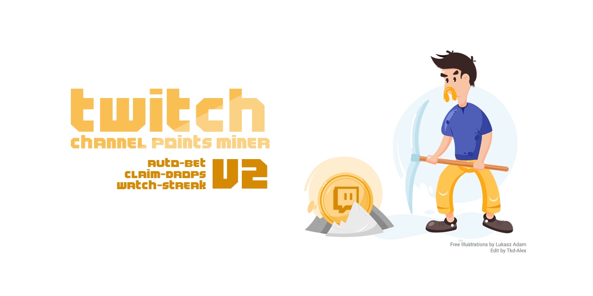
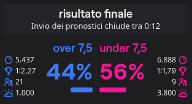
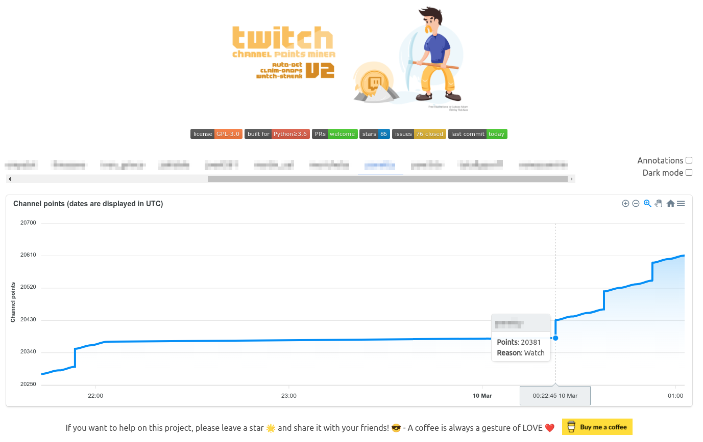
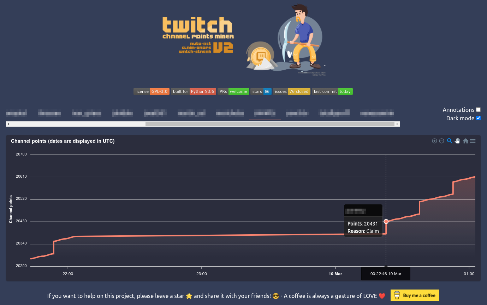

<p align="center">
<a href="https://github.com/Tkd-Alex/Twitch-Channel-Points-Miner-v2/blob/master/LICENSE"></a>
<a href="https://www.python.org/downloads/release/python-360/"></a>
<a href="https://github.com/Tkd-Alex/Twitch-Channel-Points-Miner-v2/pulls"></a>
<a href="https://github.com/Tkd-Alex/Twitch-Channel-Points-Miner-v2/stargazers"></a>
<a href="https://github.com/Tkd-Alex/Twitch-Channel-Points-Miner-v2/issues?q=is%3Aissue+is%3Aclosed"></a>
<a href="https://github.com/Tkd-Alex/Twitch-Channel-Points-Miner-v2"></a>
</p>

**Credits**
- Main idea: https://github.com/gottagofaster236/Twitch-Channel-Points-Miner
- ~~Bet system (Selenium): https://github.com/ClementRoyer/TwitchAutoCollect-AutoBet~~

> A simple script that will watch a stream for you and earn the channel points.

> It can wait for a streamer to go live (+_450 points_ when the stream starts), it will automatically click the bonus button (_+50 points_), and it will follow raids (_+250 points_).

Read more about channels point [here](https://help.twitch.tv/s/article/channel-points-guide)

# README Contents
1. 🤝 [Community](#community)
2. 🚀 [Main differences from the original repository](#main-differences-from-the-original-repository)
3. 🧾 [Logs feature](#logs-feature)
    - [Full logs](#full-logs)
    - [Less logs](#less-logs)
    - [Final report](#final-report)
4. 🧐 [How to use](#how-to-use)
    - [Limits](#limits)
5. 🔧 [Settings](#settings)
    - [LoggerSettings](#loggersettings)
    - [StreamerSettings](#streamersettings)
    - [BetSettings](#betsettings)
        - [Bet strategy](#bet-strategy)
    - [FilterCondition](#filtercondition)
        - [Example](#example)
6. 📈 [Analytics](#analytics)
7. 🍪 [Migrating from old repository (the original one)](#migrating-from-old-repository-the-original-one)
8. 🪟 [Windows](#windows)
9. 📱 [Termux](#termux)
10. ⚠️ [Disclaimer](#disclaimer)


## Community
If you have any type of issue, need help, or want to suggest a new feature, please open a GitHub Issue. Don't write me on [Instagram](https://www.instagram.com/tkd_alex/), [Telegram](https://t.me/TkdAlex), [Discord](https://discordapp.com/users/641397388132483121), [Twitter](https://twitter.com/TkdAxel) (but you can follow me 😆) or somewhere else. If you don't have an account on this platform, you can create it. It's free. I do not want to be rude, but if you have a problem, maybe another user can also have the same problem, and your issue can help the community. Same for the new feature, your idea can help other users, and It's beautiful to discuss between us.

If you want to help on this project, please leave a star 🌟 and share it with your friends! 😎

A coffee is always a gesture of LOVE ❤️

<a href="https://www.buymeacoffee.com/tkdalex" target="_blank"></a>

If you have any issues or you want to contribute, you are welcome! But please before read the [CONTRIBUTING.md](/CONTRIBUTING.md)

## Main differences from the original repository:

- Improve the logging - Emoji, colors, file and soo on
- Final report with all the data
- Rewrite the entire code using classe instead of module with global variables
- Automatic download the follower's list and use it as input
- Better 'Watch Streak' strategy in priority system [#11](https://github.com/Tkd-Alex/Twitch-Channel-Points-Miner-v2/issues/11)
- Auto claim game drops from Twitch inventory [#21](https://github.com/Tkd-Alex/Twitch-Channel-Points-Miner-v2/issues/21) Read more about game drops [here](https://help.twitch.tv/s/article/mission-based-drops)
- Place the bet / make a prediction and win or lose (🍀) your channel points!
No browser needed. [#41](https://github.com/Tkd-Alex/Twitch-Channel-Points-Miner-v2/issues/41) ([@lay295](https://github.com/lay295))
- Analytics chart that show the progress of your points with various annotations [#96](https://github.com/Tkd-Alex/Twitch-Channel-Points-Miner-v2/issues/96)
- Join IRC Chat for increase watch-time and get StreamElements points [#47](https://github.com/Tkd-Alex/Twitch-Channel-Points-Miner-v2/issues/47)

## Logs feature
### Full logs
```
%d/%m/%y %H:%M:%S - INFO - [run]: 💣  Start session: '9eb934b0-1684-4a62-b3e2-ba097bd67d35'
%d/%m/%y %H:%M:%S - INFO - [run]: 🤓  Loading data for x streamers. Please wait ...
%d/%m/%y %H:%M:%S - INFO - [set_offline]: 😴  Streamer(username=streamer-username1, channel_id=0000000, channel_points=67247) is Offline!
%d/%m/%y %H:%M:%S - INFO - [set_offline]: 😴  Streamer(username=streamer-username2, channel_id=0000000, channel_points=4240) is Offline!
%d/%m/%y %H:%M:%S - INFO - [set_offline]: 😴  Streamer(username=streamer-username3, channel_id=0000000, channel_points=61365) is Offline!
%d/%m/%y %H:%M:%S - INFO - [set_offline]: 😴  Streamer(username=streamer-username4, channel_id=0000000, channel_points=3760) is Offline!
%d/%m/%y %H:%M:%S - INFO - [set_online]: 🥳  Streamer(username=streamer-username, channel_id=0000000, channel_points=61365) is Online!
%d/%m/%y %H:%M:%S - INFO - [start_bet]: 🔧  Start betting for EventPrediction(event_id=xxxx-xxxx-xxxx-xxxx, title=Please star this repo) owned by Streamer(username=streamer-username, channel_id=0000000, channel_points=61365)
%d/%m/%y %H:%M:%S - INFO - [__open_coins_menu]: 🔧  Open coins menu for EventPrediction(event_id=xxxx-xxxx-xxxx-xxxx, title=Please star this repo)
%d/%m/%y %H:%M:%S - INFO - [__click_on_bet]: 🔧  Click on the bet for EventPrediction(event_id=xxxx-xxxx-xxxx-xxxx, title=Please star this repo)
%d/%m/%y %H:%M:%S - INFO - [__enable_custom_bet_value]: 🔧  Enable input of custom value for EventPrediction(event_id=xxxx-xxxx-xxxx-xxxx, title=Please star this repo)
%d/%m/%y %H:%M:%S - INFO - [on_message]: ⏰  Place the bet after: 89.99s for: EventPrediction(event_id=xxxx-xxxx-xxxx-xxxx-15c61914ef69, title=Please star this repo)
%d/%m/%y %H:%M:%S - INFO - [on_message]: 🚀  +12 → Streamer(username=streamer-username, channel_id=0000000, channel_points=61377) - Reason: WATCH.
%d/%m/%y %H:%M:%S - INFO - [make_predictions]: 🍀  Going to complete bet for EventPrediction(event_id=xxxx-xxxx-xxxx-xxxx-15c61914ef69, title=Please star this repo) owned by Streamer(username=streamer-username, channel_id=0000000, channel_points=61377)
%d/%m/%y %H:%M:%S - INFO - [make_predictions]: 🍀  Place 5k channel points on: SI (BLUE), Points: 848k, Users: 190 (70.63%), Odds: 1.24 (80.65%)
%d/%m/%y %H:%M:%S - INFO - [on_message]: 🚀  +6675 → Streamer(username=streamer-username, channel_id=0000000, channel_points=64206) - Reason: PREDICTION.
%d/%m/%y %H:%M:%S - INFO - [on_message]: 📊  EventPrediction(event_id=xxxx-xxxx-xxxx-xxxx, title=Please star this repo) - Result: WIN, Points won: 6675
%d/%m/%y %H:%M:%S - INFO - [on_message]: 🚀  +12 → Streamer(username=streamer-username, channel_id=0000000, channel_points=64218) - Reason: WATCH.
%d/%m/%y %H:%M:%S - INFO - [on_message]: 🚀  +12 → Streamer(username=streamer-username, channel_id=0000000, channel_points=64230) - Reason: WATCH.
%d/%m/%y %H:%M:%S - INFO - [claim_bonus]: 🎁  Claiming the bonus for Streamer(username=streamer-username, channel_id=0000000, channel_points=64230)!
%d/%m/%y %H:%M:%S - INFO - [on_message]: 🚀  +60 → Streamer(username=streamer-username, channel_id=0000000, channel_points=64290) - Reason: CLAIM.
%d/%m/%y %H:%M:%S - INFO - [on_message]: 🚀  +12 → Streamer(username=streamer-username, channel_id=0000000, channel_points=64326) - Reason: WATCH.
%d/%m/%y %H:%M:%S - INFO - [on_message]: 🚀  +400 → Streamer(username=streamer-username, channel_id=0000000, channel_points=64326) - Reason: WATCH_STREAK.
%d/%m/%y %H:%M:%S - INFO - [claim_bonus]: 🎁  Claiming the bonus for Streamer(username=streamer-username, channel_id=0000000, channel_points=64326)!
%d/%m/%y %H:%M:%S - INFO - [on_message]: 🚀  +60 → Streamer(username=streamer-username, channel_id=0000000, channel_points=64386) - Reason: CLAIM.
%d/%m/%y %H:%M:%S - INFO - [on_message]: 🚀  +12 → Streamer(username=streamer-username, channel_id=0000000, channel_points=64398) - Reason: WATCH.
%d/%m/%y %H:%M:%S - INFO - [update_raid]: 🎭  Joining raid from Streamer(username=streamer-username, channel_id=0000000, channel_points=64398) to another-username!
%d/%m/%y %H:%M:%S - INFO - [on_message]: 🚀  +250 → Streamer(username=streamer-username, channel_id=0000000, channel_points=6845) - Reason: RAID.
```
### Less logs
```
%d/%m %H:%M:%S - 💣  Start session: '9eb934b0-1684-4a62-b3e2-ba097bd67d35'
%d/%m %H:%M:%S - 🤓  Loading data for 13 streamers. Please wait ...
%d/%m %H:%M:%S - 😴  streamer-username1 (xxx points) is Offline!
%d/%m %H:%M:%S - 😴  streamer-username2 (xxx points) is Offline!
%d/%m %H:%M:%S - 😴  streamer-username3 (xxx points) is Offline!
%d/%m %H:%M:%S - 😴  streamer-username4 (xxx points) is Offline!
%d/%m %H:%M:%S - 🥳  streamer-username (xxx points) is Online!
%d/%m %H:%M:%S - 🔧  Start betting for EventPrediction: Please star this repo owned by streamer-username (xxx points)
%d/%m %H:%M:%S - 🔧  Open coins menu for EventPrediction: Please star this repo
%d/%m %H:%M:%S - 🔧  Click on the bet for EventPrediction: Please star this repo
%d/%m %H:%M:%S - 🔧  Enable input of custom value for EventPrediction: Please star this repo
%d/%m %H:%M:%S - ⏰  Place the bet after: 89.99s EventPrediction: Please star this repo
%d/%m %H:%M:%S - 🚀  +12 → streamer-username (xxx points) - Reason: WATCH.
%d/%m %H:%M:%S - 🍀  Going to complete bet for EventPrediction: Please star this repo owned by streamer-username (xxx points)
%d/%m %H:%M:%S - 🍀  Place 5k channel points on: SI (BLUE), Points: 848k, Users: 190 (70.63%), Odds: 1.24 (80.65%)
%d/%m %H:%M:%S - 🚀  +6675 → streamer-username (xxx points) - Reason: PREDICTION.
%d/%m %H:%M:%S - 📊  EventPrediction: Please star this repo - Result: WIN, Points won: 6675
%d/%m %H:%M:%S - 🚀  +12 → streamer-username (xxx points) - Reason: WATCH.
%d/%m %H:%M:%S - 🚀  +12 → streamer-username (xxx points) - Reason: WATCH.
%d/%m %H:%M:%S - 🚀  +60 → streamer-username (xxx points) - Reason: CLAIM.
%d/%m %H:%M:%S - 🚀  +12 → streamer-username (xxx points) - Reason: WATCH.
%d/%m %H:%M:%S - 🚀  +400 → streamer-username (xxx points) - Reason: WATCH_STREAK.
%d/%m %H:%M:%S - 🚀  +60 → streamer-username (xxx points) - Reason: CLAIM.
%d/%m %H:%M:%S - 🚀  +12 → streamer-username (xxx points) - Reason: WATCH.
%d/%m %H:%M:%S - 🎭  Joining raid from streamer-username (xxx points) to another-username!
%d/%m %H:%M:%S - 🚀  +250 → streamer-username (xxx points) - Reason: RAID.
```
### Final report:
```
%d/%m/%y %H:%M:%S - 🛑  End session 'f738d438-cdbc-4cd5-90c4-1517576f1299'
%d/%m/%y %H:%M:%S - 📄  Logs file: /.../path/Twitch-Channel-Points-Miner-v2/logs/username.timestamp.log
%d/%m/%y %H:%M:%S - ⌛  Duration 10:29:19.547371

%d/%m/%y %H:%M:%S - 📊  BetSettings(Strategy=Strategy.SMART, Percentage=7, PercentageGap=20, MaxPoints=7500
%d/%m/%y %H:%M:%S - 📊  EventPrediction(event_id=xxxx-xxxx-xxxx-xxxx, title="Event Title1")
		Streamer(username=streamer-username, channel_id=0000000, channel_points=67247)
		Bet(TotalUsers=1k, TotalPoints=11M), Decision={'choice': 'B', 'amount': 5289, 'id': 'xxxx-yyyy-zzzz'})
		Outcome0(YES (BLUE) Points: 7M, Users: 641 (58.49%), Odds: 1.6, (5}%)
		Outcome1(NO (PINK),Points: 4M, Users: 455 (41.51%), Odds: 2.65 (37.74%))
		Result: {'type': 'LOSE', 'won': 0}
%d/%m/%y %H:%M:%S - 📊  EventPrediction(event_id=yyyy-yyyy-yyyy-yyyy, title="Event Title2")
		Streamer(username=streamer-username, channel_id=0000000, channel_points=3453464)
		Bet(TotalUsers=921, TotalPoints=11M), Decision={'choice': 'A', 'amount': 4926, 'id': 'xxxx-yyyy-zzzz'})
		Outcome0(YES (BLUE) Points: 9M, Users: 562 (61.02%), Odds: 1.31 (76.34%))
		Outcome1(YES (PINK) Points: 3M, Users: 359 (38.98%), Odds: 4.21 (23.75%))
		Result: {'type': 'WIN', 'won': 6531}
%d/%m/%y %H:%M:%S - 📊  EventPrediction(event_id=ad152117-251b-4666-b683-18e5390e56c3, title="Event Title3")
		Streamer(username=streamer-username, channel_id=0000000, channel_points=45645645)
		Bet(TotalUsers=260, TotalPoints=3M), Decision={'choice': 'A', 'amount': 5054, 'id': 'xxxx-yyyy-zzzz'})
		Outcome0(YES (BLUE) Points: 689k, Users: 114 (43.85%), Odds: 4.24 (23.58%))
		Outcome1(NO (PINK) Points: 2M, Users: 146 (56.15%), Odds: 1.31 (76.34%))
		Result: {'type': 'LOSE', 'won': 0}

%d/%m/%y %H:%M:%S - 🤖  Streamer(username=streamer-username, channel_id=0000000, channel_points=67247), Total points gained (after farming - before farming): -7838
%d/%m/%y %H:%M:%S - 💰  CLAIM(11 times, 550 gained), PREDICTION(1 times, 6531 gained), WATCH(35 times, 350 gained)
%d/%m/%y %H:%M:%S - 🤖  Streamer(username=streamer-username2, channel_id=0000000, channel_points=61365), Total points gained (after farming - before farming): 977
%d/%m/%y %H:%M:%S - 💰  CLAIM(4 times, 240 gained), REFUND(1 times, 605 gained), WATCH(11 times, 132 gained)
%d/%m/%y %H:%M:%S - 🤖  Streamer(username=streamer-username5, channel_id=0000000, channel_points=25960), Total points gained (after farming - before farming): 1680
%d/%m/%y %H:%M:%S - 💰  CLAIM(17 times, 850 gained), WATCH(53 times, 530 gained)
%d/%m/%y %H:%M:%S - 🤖  Streamer(username=streamer-username6, channel_id=0000000, channel_points=9430), Total points gained (after farming - before farming): 1120
%d/%m/%y %H:%M:%S - 💰  CLAIM(14 times, 700 gained), WATCH(42 times, 420 gained), WATCH_STREAK(1 times, 450 gained)
```

## How to use:
1. Clone this repository `git clone https://github.com/Tkd-Alex/Twitch-Channel-Points-Miner-v2`
2. Install all the requirements `pip install -r requirements.txt` . If you have problems with requirements, make sure to have at least Python3.6. You could also try to create a virtualenv and then install all the requirements
```sh
pip install virtualenv
virtualenv -p python3 venv
source venv/bin/activate
pip install -r requirements.txt
```
3. Create your `run.py` file start from [example.py](/example.py)
```python
# -*- coding: utf-8 -*-

import logging
from colorama import Fore
from TwitchChannelPointsMiner import TwitchChannelPointsMiner
from TwitchChannelPointsMiner.logger import LoggerSettings, ColorPalette
from TwitchChannelPointsMiner.classes.Settings import Priority
from TwitchChannelPointsMiner.classes.entities.Bet import Strategy, BetSettings, Condition, OutcomeKeys, FilterCondition
from TwitchChannelPointsMiner.classes.entities.Streamer import Streamer, StreamerSettings

twitch_miner = TwitchChannelPointsMiner(
    username="your-twitch-username",
    password="write-your-secure-psw",           # If no password will be provided, the script will ask interactively
    claim_drops_startup=False,                  # If you want to auto claim all drops from Twitch inventory on the startup
    priority=[                                  # Custom priority in this case for example:
        Priority.STREAK,                        # - We want first of all to catch all watch streak from all streamers
        Priority.DROPS,                         # - When we don't have anymore watch streak to catch, wait until all drops are collected over the streamers
        Priority.ORDER                          # - When we have all of the  drops claimed and no watch-streak available, use the order priority (POINTS_ASCENDING, POINTS_DESCEDING)
    ],
    logger_settings=LoggerSettings(
        save=True,                              # If you want to save logs in a file (suggested)
        console_level=logging.INFO,             # Level of logs - use logging.DEBUG for more info)
        file_level=logging.DEBUG,               # Level of logs - If you think the log file it's too big, use logging.INFO
        emoji=True,                             # On Windows, we have a problem printing emoji. Set to false if you have a problem
        less=False,                             # If you think that the logs are too verbose, set this to True
        colored=True,                           # If you want to print colored text
        color_palette=ColorPalette(             # You can also create a custom palette color (for the common message).
            STREAMER_online="GREEN",            # Don't worry about lower/upper case. The script will parse all the values.
            streamer_offline="red",             # Read more in README.md
            BET_wiN=Fore.MAGENTA                # Color allowed are: [BLACK, RED, GREEN, YELLOW, BLUE, MAGENTA, CYAN, WHITE, RESET].
        )
    ),
    streamer_settings=StreamerSettings(
        make_predictions=True,                  # If you want to Bet / Make prediction
        follow_raid=True,                       # Follow raid to obtain more points
        claim_drops=True,                       # We can't filter rewards base on stream. Set to False for skip viewing counter increase and you will never obtain a drop reward from this script. Issue #21
        watch_streak=True,                      # If a streamer go online change the priotiry of streamers array and catch the watch screak. Issue #11
        join_chat=True,                         # Join irc chat to increase watch-time
        bet=BetSettings(
            strategy=Strategy.SMART,            # Choose you strategy!
            percentage=5,                       # Place the x% of your channel points
            percentage_gap=20,                  # Gap difference between outcomesA and outcomesB (for SMART stragegy)
            max_points=50000,                   # If the x percentage of your channel points is gt bet_max_points set this value
            stealth_mode=True,                  # If the calculated amount of channel points is GT the highest bet, place the highest value minus 1-2 points #33
            filter_condition=FilterCondition(
                by=OutcomeKeys.TOTAL_USERS,    # Where apply the filter. Allowed [PERCENTAGE_USERS, ODDS_PERCENTAGE, ODDS, TOP_POINTS, TOTAL_USERS, TOTAL_POINTS]
                where=Condition.LTE,           # 'by' must be [GT, LT, GTE, LTE] than value
                value=800
            )
        )
    )
)

# You can customize the settings for each streamer. If not settings were provided, the script would use the streamer_settings from TwitchChannelPointsMiner.
# If no streamer_settings are provided in TwitchChannelPointsMiner the script will use default settings.
# The streamers array can be a String -> username or Streamer instance.

# The settings priority are: settings in mine function, settings in TwitchChannelPointsMiner instance, default settings.
# For example, if in the mine function you don't provide any value for 'make_prediction' but you have set it on TwitchChannelPointsMiner instance, the script will take the value from here.
# If you haven't set any value even in the instance the default one will be used

twitch_miner.mine(
    [
        Streamer("streamer-username01", settings=StreamerSettings(make_predictions=True  , follow_raid=False , claim_drops=True  , watch_streak=True , bet=BetSettings(strategy=Strategy.SMART      , percentage=5 , stealth_mode=True,  percentage_gap=20 , max_points=234   , filter_condition=FilterCondition(by=OutcomeKeys.TOTAL_USERS,      where=Condition.LTE, value=800 ) ) )),
        Streamer("streamer-username02", settings=StreamerSettings(make_predictions=False , follow_raid=True  , claim_drops=False ,                     bet=BetSettings(strategy=Strategy.PERCENTAGE , percentage=5 , stealth_mode=False, percentage_gap=20 , max_points=1234  , filter_condition=FilterCondition(by=OutcomeKeys.TOTAL_POINTS,     where=Condition.GTE, value=250 ) ) )),
        Streamer("streamer-username03", settings=StreamerSettings(make_predictions=True  , follow_raid=False ,                     watch_streak=True , bet=BetSettings(strategy=Strategy.SMART      , percentage=5 , stealth_mode=False, percentage_gap=30 , max_points=50000 , filter_condition=FilterCondition(by=OutcomeKeys.ODDS,             where=Condition.LT,  value=300 ) ) )),
        Streamer("streamer-username04", settings=StreamerSettings(make_predictions=False , follow_raid=True  ,                     watch_streak=True                                                                                                                                                                                                                                 )),
        Streamer("streamer-username05", settings=StreamerSettings(make_predictions=True  , follow_raid=True  , claim_drops=True ,  watch_streak=True , bet=BetSettings(strategy=Strategy.HIGH_ODDS  , percentage=7 , stealth_mode=True,  percentage_gap=20 , max_points=90    , filter_condition=FilterCondition(by=OutcomeKeys.PERCENTAGE_USERS, where=Condition.GTE, value=300 ) ) )),
        Streamer("streamer-username06"),
        Streamer("streamer-username07"),
        Streamer("streamer-username08"),
        "streamer-username09",
        "streamer-username10",
        "streamer-username11"
    ],                                 # Array of streamers (order = priority)
    followers=False                    # Automatic download the list of your followers (unable to set custom settings for you followers list)
)
```
You can also use all the default values except for your username obv. Short version:
```python
from TwitchChannelPointsMiner import TwitchChannelPointsMiner
twitch_miner = TwitchChannelPointsMiner("your-twitch-username")
twitch_miner.mine(["streamer1", "streamer2"])                   # Array of streamers OR
twitch_miner.mine(followers=True)                               # Automatic use the followers list OR
twitch_miner.mine(["streamer1", "streamer2"], followers=True)   # Mixed
```
If you follow so many streamers on Twitch, but you don't want to mine points for all of them, you can blacklist the users with the `blacklist` keyword. [#94](https://github.com/Tkd-Alex/Twitch-Channel-Points-Miner-v2/issues/94)
```python
from TwitchChannelPointsMiner import TwitchChannelPointsMiner
twitch_miner = TwitchChannelPointsMiner("your-twitch-username")
twitch_miner.mine(followers=True, blacklist=["user1", "user2"])  # Blacklist example
```
4. Start mining! `python run.py`

### Limits
> Twitch has a limit - you can't watch more than two channels at one time. We take the first two streamers from the list as they have the highest priority.

Make sure to write the streamers array in order of priority from left to right. If you use `followers=True` Twitch return the streamers order by followed_at. So your last follow has the highest priority.

## Settings
Most of the settings are self-explained and are commented on in the example.
You can watch only two streamers per time. With `priority` settings, you can select which streamers watch by use priority. You can use an array of priority or single item. I suggest using at least one priority from `ORDER`, `POINTS_ASCENDING`, `POINTS_DESCEDING` because, for example, If you set only `STREAK` after catch all watch streak, the script will stop to watch streamers.
Available values are the following:
 - `STREAK` - Catch the watch streak from all streamers
 - `DROPS` - Claim all drops from streamers with drops tags enabled
 - `ORDER` - Following the order of the list
 - `POINTS_ASCENDING` - On top the streamers with the lowest points
 - `POINTS_DESCEDING` - On top the streamers with the highest points

You can combine all priority but keep in mind that use `ORDER` and `POINTS_ASCENDING` in the same settings doesn't make sense.

### LoggerSettings
| Key             	| Type            	| Default                        	                                  | Description                                                                          	                                                                                                  |
|-----------------	|-----------------	|-------------------------------------------------------------------- |------------------------------------------------------------------------------------------------------------------------------------------------------------------------------------------ |
| `save`          	| bool            	| True                           	                                  | If you want to save logs in file (suggested)                                         	                                                                                                  |
| `less`          	| bool            	| False                          	                                  | Reduce the logging format and message verbosity [#10](https://github.com/Tkd-Alex/Twitch-Channel-Points-Miner-v2/issues/10)                                                               |
| `console_level` 	| level 	        | logging.INFO                   	                                  | Level of logs in terminal - Use logging.DEBUG for more helpful messages.             	                                                                                                  |
| `file_level`    	| level 	        | logging.DEBUG                  	                                  | Level of logs in file save - If you think the log file it's too big, use logging.INFO 	                                                                                                  |
| `emoji`         	| bool            	| For Windows is False else True 	                                  | On Windows, we have a problem printing emoji. Set to false if you have a problem      	                                                                                                  |
| `colored`         | bool            	| True 	                                                              | If you want to print colored text [#45](https://github.com/Tkd-Alex/Twitch-Channel-Points-Miner-v2/issues/45) [#82](https://github.com/Tkd-Alex/Twitch-Channel-Points-Miner-v2/issues/82) |
| `color_palette`   | ColorPalette      | All messages are Fore.RESET except WIN and LOSE bet (GREEN and RED) | Create your custom color palette. Read more above.      	                                                                                                                              |

#### Color Palette
Now you can customize the color of the terminal message. We have created a default ColorPalette that provide all the message with `DEFAULT (RESET)` color and the `BET_WIN` and `BET_LOSE` message `GREEN` and `RED` respectively.
Currently you can only change the following types of messages:
 - `STREAMER_ONLINE`
 - `STREAMER_OFFLINE`
 - `GAIN_FOR_RAID`
 - `GAIN_FOR_CLAIM`
 - `GAIN_FOR_WATCH`
 - `BET_WIN`
 - `BET_LOSE`
 - `BET_REFUND`
 - `BET_FILTERS`
 - `BET_GENERAL`
 - `BET_FAILED`
 - `BET_START`

The colors allowed are all the Fore color from Colorama: `BLACK, RED, GREEN, YELLOW, BLUE, MAGENTA, CYAN, WHITE, RESET.`
The script was developed to handle all the human error, lower-case upper case and more, but I want to suggest using the following code-style
```python
from colorama import Fore
ColorPalette(
    STREAMER_ONLINE = Fore.GREEN,
    STREAMER_OFFLINE = Fore.RED,
    GAIN_FOR_RAID = Fore.YELLOW,
    GAIN_FOR_CLAIM = Fore.YELLOW,
    GAIN_FOR_WATCH = Fore.YELLOW,
    GAIN_FOR_WATCH_STREAK = Fore.YELLOW,
    BET_WIN = Fore.GREEN,
    BET_LOSE = Fore.RED,
    BET_REFUND = Fore.RESET,
    BET_FILTERS = Fore.MAGENTA,
    BET_GENERAL = Fore.BLUE,
    BET_FAILED = Fore.RED,
)
```

### StreamerSettings
| Key                	| Type        	| Default                        	| Description                                                                                                                                          	                                                                            |
|--------------------	|-------------	|--------------------------------	|---------------------------------------------------------------------------------------------------------------------------------------------------------------------------------------------------------------------------------- |
| `make_predictions` 	| bool        	| True                           	| Choose if you want to make predictions / bet or not                                                                                                  	                                                                            |
| `follow_raid`      	| bool        	| True                           	| Choose if you want to follow raid +250 points                                                                                                        	                                                                            |
| `claim_drops`      	| bool        	| True                           	| If this value is True, the script will increase the watch-time for the current game. With this, you can claim the drops from Twitch Inventory [#21](https://github.com/Tkd-Alex/Twitch-Channel-Points-Miner-v2/issues/21)         |
| `watch_streak`     	| bool        	| True                           	| Choose if you want to change a priority for these streamers and try to catch the Watch Streak event [#11](https://github.com/Tkd-Alex/Twitch-Channel-Points-Miner-v2/issues/11)                                                   |
| `bet`              	| BetSettings 	|  	                                | Rules to follow for the bet                                                                                                                                                                                                       |
| `follow_raid`      	| bool        	| True                           	| Choose if you want to follow raid +250 points                                                                                                        	                                                                            |
### BetSettings
| Key                	| Type            	| Default 	| Description                                                                                                    	                                                                          |
|--------------------	|-----------------	|---------	|-------------------------------------------------------------------------------------------------------------------------------------------------------------------------------------------- |
| `strategy`         	| Strategy        	| SMART   	| Choose your strategy! See above for more info                                                                  	                                                                          |
| `percentage`       	| int             	| 5       	| Place the x% of your channel points                                                                            	                                                                          |
| `percentage_gap`   	| int             	| 20      	| Gap difference between outcomesA and outcomesB (for SMART stragegy)                                            	                                                                          |
| `max_points`       	| int             	| 50000   	| If the x percentage of your channel points is GT bet_max_points set this value                                 	                                                                          |
| `stealth_mode`     	| bool            	| False   	| If the calculated amount of channel points is GT the highest bet, place the highest value minus 1-2 points [#33](https://github.com/Tkd-Alex/Twitch-Channel-Points-Miner-v2/issues/33)      |
| `join_chat` 	        | bool 	            | True    	| Join IRC-Chat to appear online in chat and attempt to get StreamElements channel points and increase view-time  [#47](https://github.com/Tkd-Alex/Twitch-Channel-Points-Miner-v2/issues/47) |

#### Bet strategy

- **MOST_VOTED**: Select the option most voted based on users count
- **HIGH_ODDS**: Select the option with the highest odds
- **PERCENTAGE**: Select the option with the highest percentage based on odds (It's the same that show Twitch) - Should be the same as select LOWEST_ODDS
- **SMART**: If the majority in percent chose an option, then follow the other users, otherwise select the option with the highest odds



Here a concrete example:

- **MOST_VOTED**: 21 Users have select **'over 7.5'**, instead of 9 'under 7.5'
- **HIGH_ODDS**: The highest odd is 2.27 on **'over 7.5'** vs 1.79 on 'under 7.5'
- **PERCENTAGE**: The highest percentage is 56% for **'under 7.5'**
- **SMART**: Calculate the percentage based on the users. The percentages are: 'over 7.5': 70% and 'under 7.5': 30%. If the difference between the two percentages is higher than `percentage_gap` select the highest percentage, else the highest odds.

In this case if percentage_gap = 20 ; 70-30 = 40 > percentage_gap, so the bot will select 'over 7.5'
### FilterCondition
| Key         	| Type        	| Default 	| Description                                                                      	|
|-------------	|-------------	|---------	|----------------------------------------------------------------------------------	|
| `by`       	| OutcomeKeys 	| None    	| Key to apply the filter                                                          	|
| `where`      	| Condition   	| None    	| Condition that should match for place bet                                        	|
| `value`     	| number      	| None    	| Value to compare                                                                 	|

Allowed values for `by` are:
- `PERCENTAGE_USERS` (no sum) [Would never want a sum as it'd always be 100%]
- `ODDS_PERCENTAGE` (no sum) [Doesn't make sense to sum odds]
- `ODDS` (no sum) [Doesn't make sense to sum odds]
- `DECISION_USERS` (no sum)
- `DECISION_POINTS` (no sum)
- `TOP_POINTS` (no sum) [Doesn't make sense to the top points of both sides]
- `TOTAL_USERS` (sum)
- `TOTAL_POINTS` (sum)

Allowed values for `where` are: `GT, LT, GTE, LTE`

#### Example
- If you want to place the bet ONLY if the total of users participants in the bet is greater than 200
`FilterCondition(by=OutcomeKeys.TOTAL_USERS, where=Condition.GT, value=200)`
- If you want to place the bet ONLY if the winning odd of your decision is greater than or equal to 1.3
`FilterCondition(by=OutcomeKeys.ODDS, where=Condition.GTE, value=1.3)`
- If you want to place the bet ONLY if the highest bet is lower than 2000
`FilterCondition(by=OutcomeKeys.TOP_POINTS, where=Condition.LT, value=2000)`

## Analytics
We have recently introduced a little frontend where you can show with a chart you points trend. The script will spawn a Flask web-server on your machine where you can select binding address and port.
The chart provides some annotation to handle the prediction and watch strike events. Usually annotation are used to notice big increase / decrease of points. If you want to can disable annotations.
On each (x, y) points Its present a tooltip that show points, date time and reason of points gained / lost. This web page was just a funny idea, and it is not intended to use for a professional usage.
If you want you can toggle the dark theme with the dedicated checkbox.

| Light theme | Dark theme |
| ----------- | ---------- |
|  |  |

For use this feature just call the `analytics` method before start mining. Read more at: [#96](https://github.com/Tkd-Alex/Twitch-Channel-Points-Miner-v2/issues/96)
The chart will be autofreshed each `refresh` minutes. If you want to connect from one to second machine that have that webpanel you have to use `0.0.0.0` instead of `127.0.0.1`.
```python
from TwitchChannelPointsMiner import TwitchChannelPointsMiner
twitch_miner = TwitchChannelPointsMiner("your-twitch-username")
twitch_miner.analytics(host="127.0.0.1", port=5000, refresh=5)   # Analytics web-server
twitch_miner.mine(followers=True, blacklist=["user1", "user2"])
```

## Migrating from an old repository (the original one):
If you already have a `twitch-cookies.pkl` and you don't want to log in again, please create a `cookies/` folder in the current directory and then copy the .pkl file with a new name `your-twitch-username.pkl`
```
.
+-- run.py
+-- cookies
|   +-- your-twitch-username.pkl
```

## Windows
Other users have find multiple problems on Windows my suggestion are:
 - Stop use Windows :stuck_out_tongue_closed_eyes:
 - Suppress the emoji in logs with `logger_settings=LoggerSettings(emoji=False)`

Other useful info can be founded here:
- https://github.com/gottagofaster236/Twitch-Channel-Points-Miner/issues/31
- https://github.com/Tkd-Alex/Twitch-Channel-Points-Miner-v2/issues/55

You can also follow this [video tutorial](https://www.youtube.com/watch?v=0VkM7NOZkuA).

## Termux
Install the requirements
```
pkg install python git rust libjpeg-turbo libcrypt ndk-sysroot clang zlib`
LDFLAGS="-L${PREFIX}/lib/" CFLAGS="-I${PREFIX}/include/" pip install --upgrade wheel pillow
```

Clone this repository
`git clone https://github.com/Tkd-Alex/Twitch-Channel-Points-Miner-v2`

(2 way):
Download sources from GitHub and put it into your Termux storage

Now you can enter the directory with our miner, type this command:
`cd Twitch-Channel-Points-Miner-v2`

Configure your miner on your preferences by typing
`nano example.py`

When you have configured it now we can rename it (optional):
`mv example.py run.py`

We have to also install dependences required to run miner:
`pip install -r requirements.txt`

Now when we did everything we can run miner:
`python run.py`

Read more at [#92](https://github.com/Tkd-Alex/Twitch-Channel-Points-Miner-v2/issues/92) [#76](https://github.com/Tkd-Alex/Twitch-Channel-Points-Miner-v2/issues/76)

## Disclaimer
This project comes with no guarantee or warranty. You are responsible for whatever happens from using this project. It is possible to get soft or hard banned by using this project if you are not careful. This is a personal project and is in no way affiliated with Twitch.
