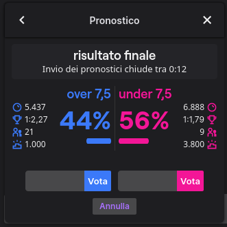

# Twitch Channel Points Miner - v2

This is a fork of: https://github.com/gottagofaster236/Twitch-Channel-Points-Miner. <br>
I've also take some piece of code - and idea to use Selenium fo do bet from: https://github.com/ClementRoyer/TwitchAutoCollect-AutoBet

> A simple script that will watch a stream for you and earn the channel points.

> It can wait for a streamer to go live (+_450 points_ when the stream starts), it will automatically click the bonus button (_+50 points_), and it will follow raids (_+250 points_).

Read more here: https://help.twitch.tv/s/article/channel-points-guide?language=en_US


## Main difference from the original repository:

- Improve the logging
- Final report with all the datas
- Rewrite the entire code using classe instead of module with global variables
- Automatic download the followers list and use as input
- Place the bet / make prediction and won or lose (good luck) your channel points!
**CURRENTLY IN BETA / VERY UNSTABLE**

For the bet system the script use Selenium. Could be usefull how to MakePrediction usign a [POST] request. I've also write a [poc](/TwitchChannelPointsMiner/classes/Twitch.py#L160) but I don't know how to calculate/create the transactionID. Any helps are welcome

## How to use:
1. Clone this repository `git clone https://github.com/Tkd-Alex/Twitch-Channel-Points-Miner-v2`
2. Install all the requirements `pip install -r requirements.txt`
3. Create your `run.py` file start from [example.py](/example.py)
```python
# -*- coding: utf-8 -*-

import logging
from TwitchChannelPointsMiner import TwitchChannelPointsMiner
from TwitchChannelPointsMiner.classes.Logger import LoggerSettings
from TwitchChannelPointsMiner.classes.Bet import Strategy, BetSettings
from TwitchChannelPointsMiner.classes.TwitchBrowser import Browser, BrowserSettings

twitch_miner = TwitchChannelPointsMiner(
    username="your-twitch-username",
    make_predictions=True,  # If you want to Bet / Make prediction
    follow_raid=True,  # Follow raid to obtain more points
    logger_settings=LoggerSettings(
        save=True,  # If you want to save logs in file (suggested)
        level=logging.INFO,  # Level of logs - use logging.DEBUG for more info)
        emoji=True,  # On Windows we have a problem to print emoji. Set to false if you have a problem
    ),
    browser_settings=BrowserSettings(
        browser=Browser.FIREFOX,  # Choose if you want to use Chrome or Firefox as browser
        show=False,  # Show the browser during bet
        do_screenshot=False,  # Do screenshot during the bet
    ),
    bet_settings=BetSettings(
        strategy=Strategy.SMART,  # Choose you strategy!
        percentage=5,  # Place the x% of your channel points
        percentage_gap=20,  # Gap difference between outcomesA and outcomesB (for SMART stragegy)
        max_points=50000,  # If the x percetage of your channel points is gt bet_max_points set this value
    )
)

twitch_miner.mine(
    ["streamer1", "streamer2"],  # Array of streamers
    followers=False  # Automatic download the list of your followers
)
```
You can also use all the default values except for your username obv. Short version:
```python
from TwitchChannelPointsMiner import TwitchChannelPointsMiner
twitch_miner = TwitchChannelPointsMiner("your-twitch-username")
twitch_miner.mine(["streamer1", "streamer2"])  # Array of streamers
twitch_miner.mine(followers=True)  # Automatic use the followers list
twitch_miner.mine(["streamer1", "streamer2"], followers=True)  # Mixed
```
4. Start mining! `python run.py`

### Bet strategy

- **MOST_VOTED**: Select the option most voted based on users count
- **HIGH_ODDS**: Select the option with the highest odds
- **PERCENTAGE**: Select the option with the highest percentage based on odds (It's the same that show Twitch) - Should be the same of select LOWEST_ODDS
- **SMART**: If the majority in percent chose an option then follow the other users, otherwise choose the option with the highest odds



Here a concrete example:

- **MOST_VOTED**: 21 Users have select **'over 7.5'**, instead of 9 'under 7.5'
- **HIGH_ODDS**: The highest odd is 2.27 on **'over 7.5'** vs 1.79 on 'under 7.5'
- **PERCENTAGE**: The highest percentage is 56% for **'under 7.5'**
- **SMART**: Calculate the percentage based on the users. The percentage are: 'over 7.5': 70% and 'under 7.5': 30%. If the difference between the two percatage are highter thant `percentage_gap` select the highest percentage, else the highest odds.
In this case if percentage_gap = 20 ; 70-30 = 40 > percentage_gap, so the bot will select 'over 7.5'

## Migrating from old repository (the original one):
If you already have a `twitch-cookies.pkl` and you don't want to login again please create a `cookies/` folder in the current directory and then copy the .pkl file with a new name `your-twitch-username.pkl`
```
.
+-- run.py
+-- cookies
|   +-- your-twitch-username.pkl
```

## Windows
Other users have find multiple problems on Windows my suggestion are:
 - Stop use Windows :stuck_out_tongue_closed_eyes:
 - Suppress the emoji in logs with `logger_settings=LoggerSettings(emoji=False)`
 - Download the geckodriver from here: https://github.com/mozilla/geckodriver/releases/ and extract in the same folder of this project. For other issue with geckodriver just googling: https://stackoverflow.com/questions/40208051/selenium-using-python-geckodriver-executable-needs-to-be-in-path


## Use Chrome instead Firefox
If you prefer Chrome instead Firefox please download the WebDriver matching with your Chrome version and OS from this link: https://chromedriver.chromium.org/downloads.
Extract the archivie, copy the chromedriver file in this project folder.
Edit your run.py file and the browser_settings should something like this:
```python
browser_settings=BrowserSettings(
    browser=Browser.CHROME,
    driver_path="/path/of/your/chromedriver"  # If no path was provided the script will try to search automatically
),
```
