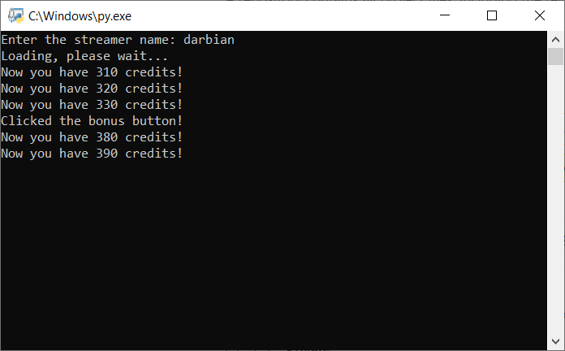

# Twitch Channel Points Miner - v2

This is a fork of: https://github.com/gottagofaster236/Twitch-Channel-Points-Miner. <br>
I've also take some piece of code - and idea to use Selenium fo do bet from: https://github.com/ClementRoyer/TwitchAutoCollect-AutoBet

> A simple script that will watch a stream for you and earn the channel points.

> It can wait for a streamer to go live (+_450 points_ when the stream starts), it will automatically click the bonus button (_+50 points_), and it will follow raids (_+250 points_).

Read more here: https://help.twitch.tv/s/article/channel-points-guide?language=en_US



## Main difference from the original repository:

- Improve the logging
- Final report with all the datas
- Rewrite the entire code using classe instead of module with global variables
- Place the bet / make prediction and won or lose (good luck) your channel points!

## How to use:
1. Clone or download this repository `git clone https://github.com/Tkd-Alex/Twitch-Channel-Points-Miner-v2`
2. Install all the requirements `pip install -r requirements.txt`
3. Create your `run.py` file start from [example.py](/example.py)
```python
from TwitchChannelPointsMiner import TwitchChannelPointsMiner

twitch_miner = TwitchChannelPointsMiner(
    username="your-twitch-username",
    make_predictions=True,  # If you want to Bet / Make prediction
    follow_raid=True,  # Follow raid to obtain more points
    save_logs=True,  # Save logs in file
    show_browser=False,  # Show the browser during bet
    do_browser_screenshot=False,  # Do screenshot during the bet
    bet_strategy=Strategy.SMART,  # Choose you strategy!
    bet_percentage=5,  # Place the x% of your channel points
    bet_percentage_gap=20,  # Gap difference between outcomesA and outcomesB (for SMART stragegy)
    bet_max_points=50000,  # If the x percetage of your channel points is gt bet_max_points set this value
)

twitch_miner.mine(["streamer1", "streamer2"])  # Array of streamers
```
4. Start mining! `python run.py`

### Bet strategy

- **MOST_VOTED**: Select the option most voted based on users count
- **HIGH_COTE**: Select the option with the highest cote
- **SMART**: If the majority in percent chose an option then follow the other users, otherwise choose the option with the highest cote

## Migrating from old repository (the original on):
If you already have a `twitch-cookies.pkl` and you don't want to login again please create a `cookies/` folder in the current directory and then copy the .pkl file with a new name `your-twitch-username.pkl`
```
.
+-- run.py
+-- cookies
|   +-- your-twitch-username.pkl
```
